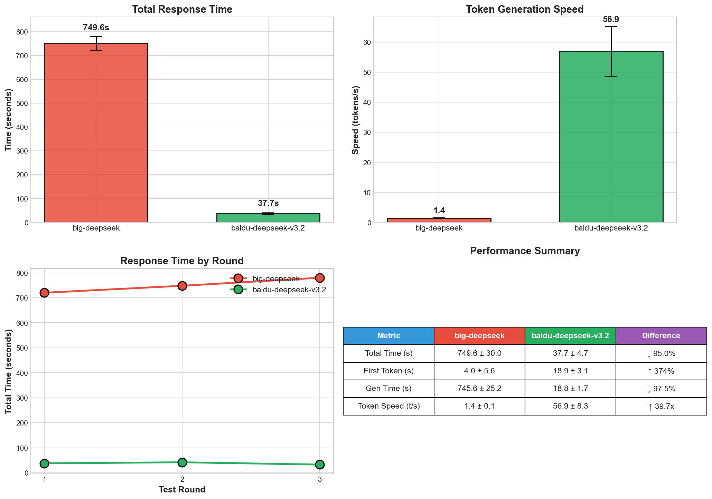

# DeepSeek API 性能测试报告

## 一、测试概述

| 项目 | 说明 |
|-----|------|
| 测试时间 | 2026年3月 |
| 测试对象 | big-deepseek vs baidu-deepseek-v3.2 |
| 测试方法 | 相同任务、相同输入条件下各进行3轮测试 |
| 测试指标 | 总耗时、首Token延迟、Token生成速度 |

---

## 二、测试结果



### 核心数据对比

| 指标 | big-deepseek | baidu-deepseek-v3.2 | 差异 |
|------|-------------|---------------------|------|
| 总耗时 | 749.6s | 37.7s | **baidu快95%** |
| 首Token延迟 | 4.0s | 18.9s | big快79% |
| Token生成速度 | 1.4 t/s | 56.9 t/s | **baidu快40倍** |
| 输出字符数 | 2123 | 2122 | 基本一致 |

---

## 三、结论

所里deepseek api速度很慢，不适用于生产环境使用
1. **baidu-deepseek-v3.2 整体性能显著领先**：总耗时仅为 big-deepseek 的 5%，Token生成速度是其40倍

2. **big-deepseek 首Token响应更快**：适合需要快速首字响应的交互场景

3. **输出质量一致**：两者输出字符数基本相同

---

## 四、测试代码

```
python test_api_speed.py
```

---

